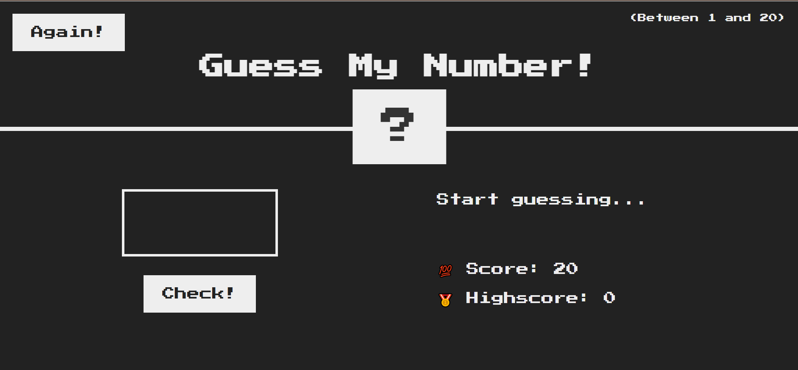

Guess My Number - A JavaScript Game

About the Project

Guess My Number is a simple and interactive game built using HTML, CSS, and JavaScript. The game challenges players to guess a randomly generated number within a given range.

🎮 How to Play

The game selects a random number between 1 and 20.

The player enters a guess in the input box.

The game provides feedback:

📉 Too Low! → Try a higher number.

📈 Too High! → Try a lower number.

✅ Correct! → You guessed the right number! 🎉

The player can reset the game anytime to play again.

🔧 Technologies Used

HTML → Structure of the game

CSS → Styling and layout

JavaScript → Game logic and interactivity

🖥️ Demo

🎥 Check out the live demo: **[  ]**  

📸 Screenshots
  

📂 Project Structure

guess-my-number-game/
│── index.html
│── style.css
│── script.js
│── README.md

📜 How to Run Locally

Clone the repository:

git clone https://github.com/Pratik1Bhuwad/guess-my-number-game-Js.git

Open the index.html file in your browser.
Start playing! 

🙌 Let's Connect

If you like this project, feel free to ⭐ the repo and connect with me on LinkedIn.
